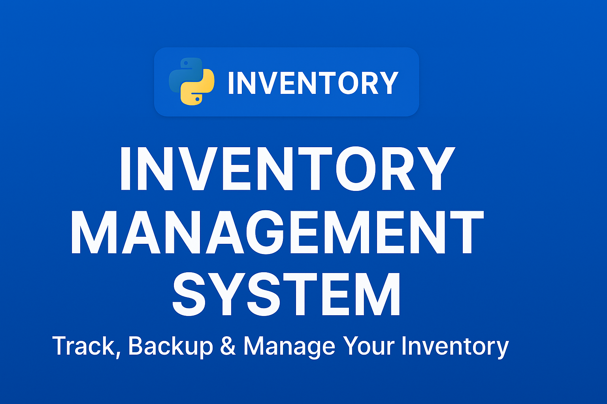

Perfect! Let’s make a **professional README.md** for your Inventory Management project with all the elements you asked for: banner, badges, username, and clear instructions.

Here’s a polished version you can directly use:

```markdown
<p align="center">
  
</p>

# Inventory Management System

**Author:** [Rumaisas-islam](https://github.com/Rumaisas-islam)  
**Language:** Python 🐍  

 


---

## Overview
This is a **simple console-based Inventory Management System** in Python that allows you to:

- Add inventory items  
- Search inventory by `Item_ID`, `Item_Name`, `Category`, or `Supplier_Name`  
- Delete inventory items  
- Update inventory items  
- View all inventory IDs, names, or full inventory records  

The program maintains an **inventory text file (`inventory.txt`)** and creates **backups** before deletion or update.

---

## Features
1. **ID Generator:** Automatically generates unique `Item_ID`.  
2. **Validation:** Input checks for proper data types.  
3. **Backup:** Automatic backup created before deletion or update.  
4. **Search:** Search inventory by multiple fields.  
5. **View Options:** View only IDs, names, or all inventory details.  

---

## File Structure
```

Inventory-Management/
│
├── inventory.txt         # Main inventory data file
├── sample.txt            # Sample data for testing
├── test/                 # Folder for automated tests
├── banner.png            # Project banner
├── LICENSE               # MIT License
├── README.md             # Project documentation
└── .gitignore            # Git ignore file

```

---

## How to Run
1. Clone the repository:
```bash
git clone https://github.com/Rumaisas-islam/Python-Inventory-Management-System.git
```

2. Navigate to the project folder:

```bash
cd Inventory-Management
```

3. Run the program:

```bash
python inventory_management.py
```

4. Follow the on-screen menu to manage inventory.

---

## Testing

Automated tests are included in the `test/` folder. Run tests using:

```bash
python -m unittest discover test
```

---

## License

This project is licensed under the **MIT License**. See [LICENSE](LICENSE) for details.

---

## Author

[Rumaisas-islam](https://github.com/Rumaisas-islam)
Python Developer | Console App Enthusiast
